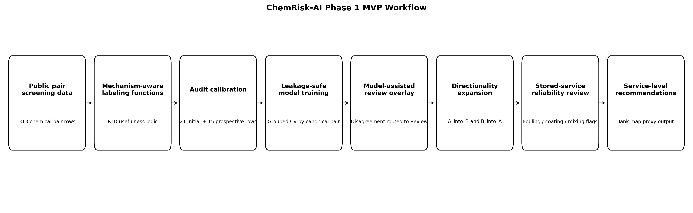
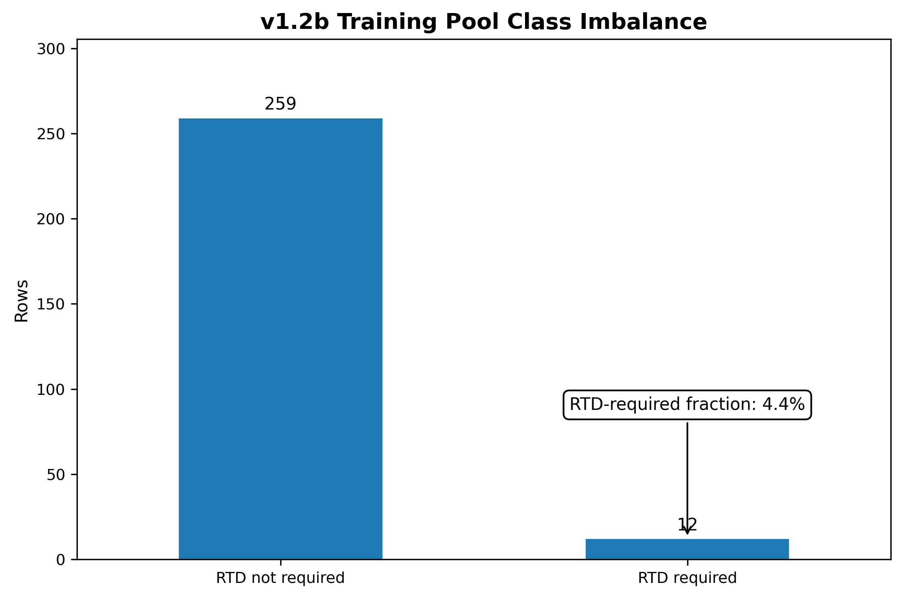
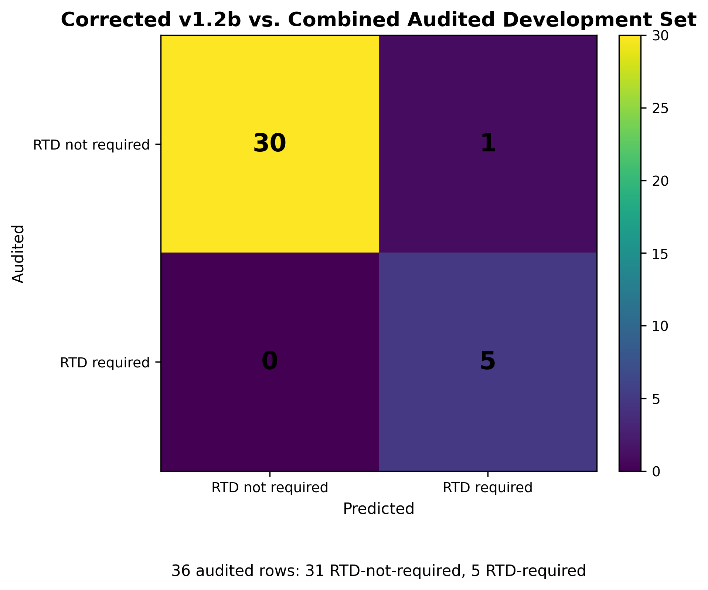
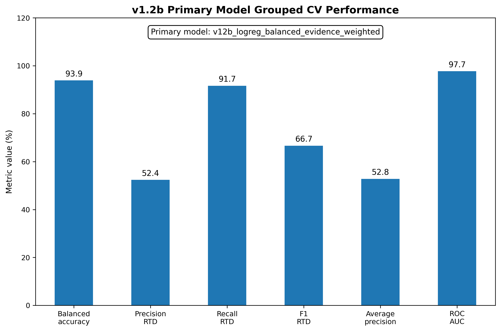
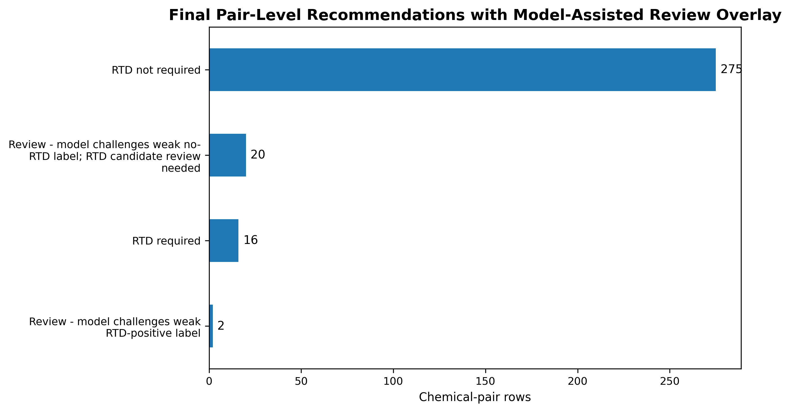
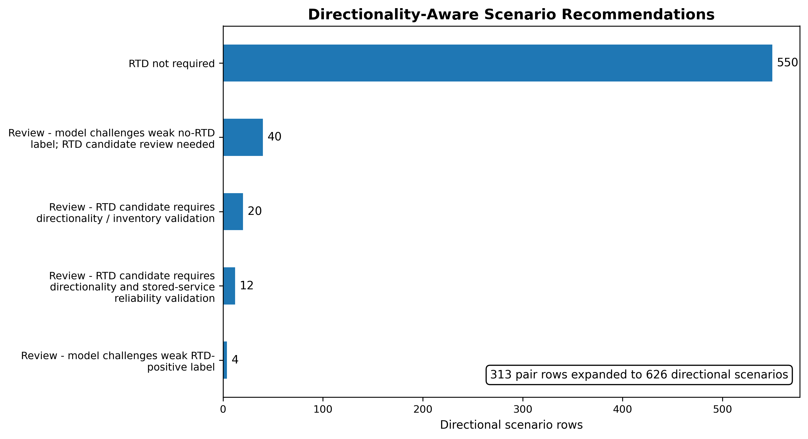
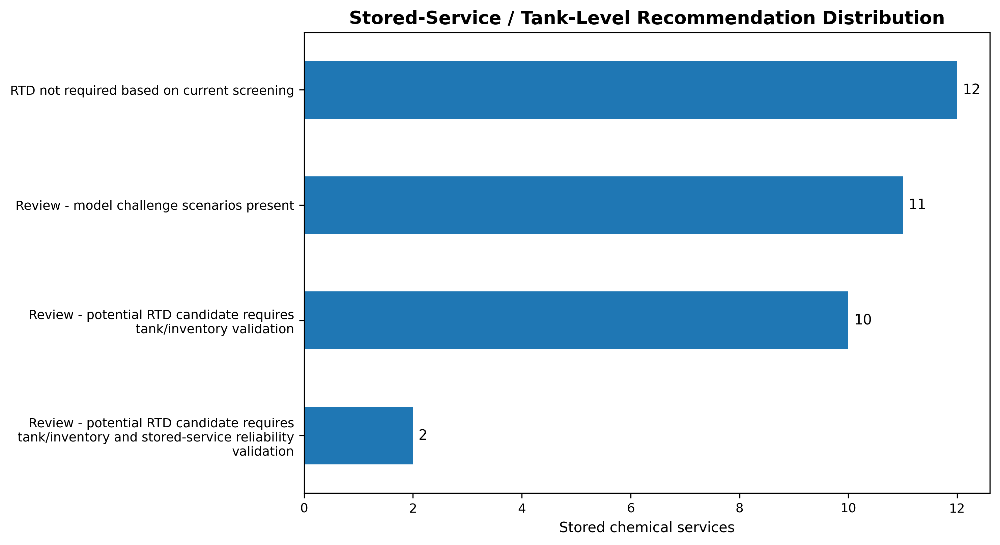
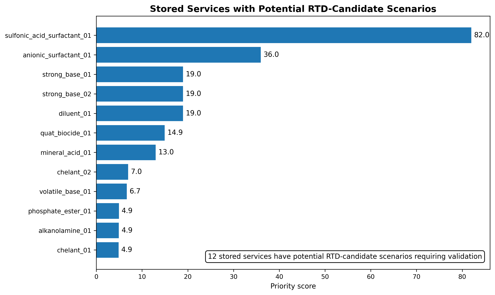

# ChemRisk-AI: Mechanism-Aware Safeguard Decision Support

**ChemRisk-AI** is an industrial AI capstone project focused on chemical process safety. It demonstrates how weak supervision, audited engineering logic, and interpretable tabular modeling can help prioritize whether a **Resistance Temperature Detector (RTD)** is a useful safeguard for an incompatible chemical mixing scenario.

This project is intentionally framed as **decision support**, not automated safety approval. It shows how machine learning can help organize conservative screening data, surface review cases, and convert pair-level chemical incompatibility information into direction-aware tank/service recommendations.



---

## Executive summary

Chemical manufacturing and bulk-liquid storage operations commonly maintain chemical incompatibility screens. These screens identify what could happen if two materials are accidentally mixed: heat generation, gas evolution, toxic vapor release, pressure rise, fire, corrosion, or fouling.

Those screens are often intentionally conservative. That conservatism is appropriate for safety, but it can make mitigation decisions difficult. A high-severity chemical pair does **not** automatically mean a temperature sensor is the right safeguard.

ChemRisk-AI addresses one practical engineering question:

> **When two incompatible chemicals could be accidentally mixed, is an RTD useful, creditable, and practical as a safeguard?**

The project uses a mechanism-aware weak-supervision workflow to classify chemical-pair scenarios as:

- **RTD not required** based on current screening logic,
- **RTD candidate / RTD required** before tank-level validation,
- or **Review** when model disagreement, directionality, inventory, or stored-service reliability prevents a confident automated recommendation.

---

## What is an RTD, and why does this matter?

An **RTD** is a Resistance Temperature Detector: an instrument used to measure temperature in a tank or process vessel.

For incompatible mixing safeguards, an RTD may be useful when the hazardous event creates a **detectable bulk liquid temperature rise** soon enough for alarm, operator response, interlock action, or another protective response.

However, an RTD may be the wrong safeguard when the dominant hazard is:

- toxic gas or vapor release,
- rapid gas generation or pressure rise,
- fire or decomposition,
- localized reaction faster than bulk temperature detection,
- gel, sludge, precipitation, coating, or fouling,
- poor mixing or phase separation,
- or an unresolved tank directionality issue.

In those cases, an RTD can appear attractive because the reaction “generates heat,” but it may not provide creditable risk reduction. ChemRisk-AI focuses on that distinction.

---

## Why this project is useful beyond one company

ChemRisk-AI should be understood as a **generalizable workflow**, not as a finished universal chemical-compatibility product.

The current Phase 1 model was developed from a structured chemical-pair screening dataset. That means the model is most directly useful when a site already has, or can create, similar structured inputs:

- chemical-pair combinations,
- generic chemical classes,
- consequence / severity screening,
- heat-generation flags,
- gas-generation flags,
- toxic-gas flags,
- fire / flammability flags,
- corrosion flags,
- reaction-type or mechanism indicators,
- and enough site context to map stored chemicals to tank services.

That limitation is important. The current model should **not** be presented as a tool that can accept any arbitrary site inventory or SDS library and automatically produce final RTD installation scope. A broader production version would need additional chemical coverage, controlled SDS or compatibility-matrix ingestion, confidence-scored mapping from actual chemicals to generic mechanism classes, tank inventory data, and multi-site validation.

The value of the Phase 1 project is the decision-support architecture:

```text
Conservative incompatibility screening
→ mechanism-aware RTD creditability logic
→ weak-supervision label generation
→ audit-calibrated model review
→ directionality expansion
→ stored-service / tank-level aggregation
→ plain-English design-basis explanations
```

That workflow is useful beyond one company because many process-industry sites face the same problem: conservative incompatibility screens identify many severe scenarios, but they do not directly answer whether a specific safeguard, such as an RTD, is useful, creditable, and practical.

In a future deployment, each site would not need to create its own audited ML dataset from scratch. Instead, a central or corporate model-development process would maintain the chemical-class library, audited examples, labeling functions, model versions, and validation history. Each site would provide its own tank list, chemical inventory, SDSs or compatibility matrix, concentration/grade information, and credible transfer scenarios. The system would then generate tank-level RTD review recommendations with clear uncertainty and mapping-confidence flags.

In short:

- the **current model** is calibrated to the available structured dataset,
- the **current Florence-style use case** can use the model to support RTD scope review,
- the **generalizable contribution** is the auditable workflow and explanation framework,
- and broader deployment would require SDS ingestion, chemical mapping controls, expanded audits, and multi-site validation.

The public version of this repository avoids company-specific identifiers, private audit workbooks, raw engineering notes, site names, tank IDs, and real deployment data.

---

## Why Not Just Use a General-Purpose LLM?

A general-purpose LLM could be valuable in a future version of this workflow, especially for extracting structured information from Safety Data Sheets. However, this project does not rely on an LLM as the final decision-maker.

For safety-critical safeguard recommendations, the system needs more than plausible chemical reasoning. It needs a controlled schema, reproducible decision logic, audit traceability, versioned calibration, leakage-safe evaluation, explicit uncertainty handling, and human-in-the-loop review.

In a future production architecture, an LLM or SDS parser could help map raw SDS text into structured chemical classes and hazard features. ChemRisk-AI would then use those structured features to produce mechanism-aware recommendations, direction-specific scenarios, and tank-level review routing.

In short:

- LLMs are useful for reading and extracting information from unstructured documents.
- ChemRisk-AI is designed for controlled, auditable decision routing.
- The safest architecture would combine both rather than use either one alone.

---

## Current MVP vs. Future Product

**MVP** means **Minimum Viable Product**: the smallest working version that demonstrates the core workflow and value proposition. For ChemRisk-AI, the Phase 1 MVP is not a broad commercial product. It is a reproducible decision-support workflow that shows how conservative chemical incompatibility screening data can be converted into RTD-specific, direction-aware engineering review recommendations.

The current MVP is useful because it demonstrates the decision architecture:

- rebuild conservative screening logic in Python,
- apply mechanism-aware weak supervision,
- calibrate rules with audited engineering review rows,
- train leakage-safe tabular models,
- route model disagreements to Review,
- expand pair-level results into `A_into_B` and `B_into_A` directional scenarios,
- and aggregate directional scenarios into service/tank-level review priorities.

The current MVP does **not** claim to classify arbitrary chemicals from raw SDS files or generalize to every site without additional data. The future product would add SDS ingestion, chemical identity normalization, confidence-scored class mapping, tank inventory mapping, and multi-site validation.

| Phase | Scope | Status |
|---|---|---|
| Phase 1 | Weak-supervised MVP using structured chemical-pair data, audited calibration, model-assisted review, and direction-aware tank/service aggregation | Completed in this repository |
| Phase 2 | Synthetic demo app where users can select generic chemical classes and view recommendation explanations | Future enhancement |
| Phase 3 | SDS ingestion and chemical class mapping using NLP/LLM-assisted extraction plus deterministic validation checks | Future product direction |
| Phase 4 | Multi-site validation with larger audited datasets, tank maps, inventory context, and outcome/lab data where available | Future product direction |

---

## Project objective

The Phase 1 MVP demonstrates a reproducible workflow that:

1. rebuilds spreadsheet-based chemical screening logic in Python,
2. verifies spreadsheet-to-Python parity,
3. creates mechanism-aware labeling functions,
4. calibrates weak labels against audited expert review rows,
5. trains leakage-safe tabular models using grouped cross-validation,
6. uses the model as a review overlay rather than an automatic override,
7. expands each chemical pair into directional scenarios (`A_into_B` and `B_into_A`),
8. applies stored-service RTD reliability review logic,
9. and aggregates directional scenarios into service/tank-level recommendations.

---

## What this project is not

ChemRisk-AI is **not**:

- production safety software,
- a first-principles reaction-kinetics simulator,
- a replacement for HAZOP, PHA, management of change, or engineering review,
- a model trained on incident outcome data,
- or an automatic decision-maker for installing or omitting safeguards.

It is a Phase 1 decision-support MVP that demonstrates how domain knowledge and machine learning can work together when labels are sparse and safety decisions must remain human-in-the-loop.

---

## Methodology

### 1. Weak supervision

The project uses engineering-informed **labeling functions** instead of assuming a large clean labeled dataset exists. Each labeling function votes only when its mechanism conditions apply. Otherwise, it abstains.

Examples of mechanism-aware signals include:

- severe heat-generating bulk acid/base neutralization,
- toxic-gas dominant mechanisms,
- gas/pressure generation that may outrun RTD response,
- oxidizer/reducer chemistry,
- phase behavior, gel, sludge, or fouling risk,
- and stored-service RTD reliability review flags.

### 2. Audit calibration

A manually reviewed audit set was used to calibrate the labeling logic. The project used:

- **21 initial audited rows** for first-pass diagnostics and calibration,
- plus **15 prospective stress-test audit rows** selected after freezing the earlier rule version.

The combined 36-row audit set is useful for calibration and error discovery. It is not presented as statistically powered production validation.

### 3. Leakage-safe grouped modeling

The model is trained on weak labels after excluding audited rows and repeated canonical chemical-pair groups. Grouped cross-validation is used so repeated versions of the same unordered chemical pair do not leak across train/test folds.

### 4. Model-assisted review overlay

The final model does **not** silently override the mechanism-aware weak-label layer. If the model disagrees with the calibrated labeling logic, the scenario is routed to **Review**.

This is intentional. In a safety-critical workflow, model disagreement is a signal for engineering attention, not a reason to automate a safeguard decision.

### 5. Explanation layers: row-level, directional, and service-level design basis

The public notebook includes explanation builders that turn model and rule outputs into engineer-readable fields instead of leaving recommendations as unexplained model predictions.

For each pair or directional scenario, the explanation layer can report:

- the final recommendation,
- the primary reason,
- mechanism evidence from labeling functions and proxy flags,
- model evidence such as score, disagreement, or near-boundary behavior,
- missing tank/site context,
- and site-validation requirements before RTD is credited or rejected.

The later service-level explanation sections aggregate those pair/directional explanations into stored-service or tank-facing design-basis outputs. For retained RTD-candidate scenarios, the enhanced chemistry-basis output is intended to show:

- source severity basis,
- heat-generation basis,
- reaction type / mechanism class,
- positive RTD pathway,
- why an RTD could detect the event,
- failure modes checked and not found,
- and remaining site validation needed before RTD credit.

The explanation output also separates **strong positive chemistry basis** cases from **weaker screening-retained** cases. Stronger cases have a specific bulk-thermal chemistry basis, such as bulk acid/base exotherm, protected acid/base RTD pathway, or calibrated RTD-positive pattern. Weaker screening-retained cases have high source severity plus heat and were not eliminated by the no-RTD failure-mode screen, but they require stronger engineering review before final RTD credit.

This explanation layer is more important than treating the tabular model as a black box. In a safety-critical workflow, a recommendation should be traceable to engineering logic, chemistry basis, failure-mode screening, and review conditions, not only to a probability score.

### 6. Direction-aware tank/service layer

A chemical pair `A + B` is expanded into two conceptual scenarios:

- `A_into_B`: chemical A enters a tank storing chemical B,
- `B_into_A`: chemical B enters a tank storing chemical A.

This matters because inventory, dilution, concentration, order of addition, tank level, mixing, and stored service can change whether an RTD is creditable.

---

## Key results

### Dataset and audit summary

| Item | Value |
|---|---:|
| Public chemical-pair rows | 313 |
| Directional scenario rows | 626 |
| Combined audited rows | 36 |
| Audited RTD-required rows | 5 |
| Audited RTD-not-required rows | 31 |
| Post-audit leakage-safe training rows | 271 |
| RTD-required weak labels in training pool | 11 |
| RTD-required fraction in training pool | 4.1% |

### Corrected v1.2b audit calibration

| Metric | Result |
|---|---:|
| Accuracy | 97.2% |
| Balanced accuracy | 98.4% |
| RTD precision | 83.3% |
| RTD recall | 100.0% |
| RTD F1 | 90.9% |
| False positives | 1 |
| False negatives | 0 |

### Primary grouped cross-validation model

The selected diagnostic model was an evidence-weighted logistic regression model. It was selected because it preserved recall on the rare RTD-required class.

| Metric | Result |
|---|---:|
| Balanced accuracy | 98.3% |
| RTD precision | 55.0% |
| RTD recall | 100.0% |
| RTD F1 | 71.0% |
| Average precision | 60.0% |
| ROC-AUC | 98.2% |
| False positives | 9 |
| False negatives | 0 |

The precision is interpreted in the context of strong class imbalance and the intended safety-biased operating mode. Only 4.1% of the training pool is RTD-required, so the model is primarily used to enrich and route rare RTD-candidate scenarios to review rather than automate installation decisions.

### Why recall was prioritized over precision

For this use case, the model was intentionally tuned and selected to protect recall on the rare RTD-required class. In a safety-critical screening workflow, a false negative could incorrectly screen out a scenario where RTD may deserve engineering review. A false positive, by contrast, routes an additional scenario to review but does not automatically authorize RTD installation.

The selected evidence-weighted logistic regression model achieved 100% recall and zero false negatives in grouped cross-validation, while precision was 55.0%. This means the model was intentionally conservative: it preferred to over-route some scenarios to human review rather than miss a potentially RTD-creditable case.

Because only 11 of 271 leakage-safe training rows were RTD-required weak labels, grouped cross-validation metrics should be interpreted as diagnostic rather than production validation. The workflow addresses this class imbalance by using mechanism-aware labeling functions, audit calibration, evidence-weighted modeling, grouped cross-validation, and review routing for model disagreements or uncertain cases.

The model is therefore not used as an automatic installation decision-maker. It is used as a review overlay that helps surface rare RTD-candidate scenarios while preserving human engineering judgment.

### Final pair-level overlay

| Pair-level recommendation | Count |
|---|---:|
| RTD not required | 279 |
| RTD required before directional validation | 12 |
| Review - model challenges v1.2b weak label | 22 |

---

## Portfolio visuals

### Class imbalance



### Audit calibration



### Grouped CV metrics



### Pair-level recommendation distribution



### Directionality-aware scenario recommendations



### Stored-service / tank-level recommendation distribution



### RTD-candidate stored-service priorities



---

## Repository structure

```text
chemrisk-ai/
├── README.md
├── GITHUB_UPLOAD_CHECKLIST.md
├── LICENSE
├── .gitignore
├── notebooks/
│   └── 01_chemrisk_ai_phase1_mvp_final_public_v8.ipynb
├── docs/
│   ├── ChemRisk_AI_Capstone_Design_Doc_Final_GitHub_Review_v1_2.docx
│   └── ChemRisk_AI_Capstone_Design_Doc_Final_GitHub_Review_v1_2.pdf
├── figures/
│   ├── 01_chemrisk_ai_architecture.png
│   ├── 02_v12b_class_imbalance.png
│   ├── 03_v12b_audit_confusion_matrix.png
│   ├── 04_v12b_grouped_cv_metrics.png
│   ├── 05_pair_level_recommendation_distribution.png
│   ├── 06_directional_scenario_recommendation_distribution.png
│   ├── 07_stored_service_recommendation_distribution.png
│   └── 08_rtd_candidate_stored_service_priorities.png
├── outputs/
│   ├── chemrisk_ai_phase1_final_summary.csv
│   └── chemrisk_ai_phase1_model_card.csv
└── data/
    ├── README.md
    ├── public_colab_values_schema.csv
    ├── gold_set_audit_schema.csv
    └── prospective_audit_schema.csv
```

---

## Data and privacy boundary

The raw source workbooks and detailed gold-set audit files are intentionally omitted from the public repository.

They are not included because they contain private engineering review details and development audit notes. The public package includes:

- a notebook source file with private outputs stripped,
- schemas describing the expected input structures,
- a design document,
- model-card and summary outputs,
- and final figures.

To run the notebook end-to-end, provide private or synthetic input files matching the schemas in `data/`. A fully runnable synthetic demo is planned as future work.

When the notebook is run with the required inputs, it can also generate additional design-basis exports such as service-level explanations, RTD-candidate scenario details, and enhanced chemistry-basis summaries. Those generated CSV files are useful for private project review, but they should be checked for site-specific or audit-sensitive details before being published.

---

## Deployment status

This project is not deployed as a live web application in Phase 1.

That is intentional. The Phase 1 deliverable is an auditable safety decision-support workflow, not an automated public-facing prediction service. Because the full audit inputs are private and the use case is safety-critical, a live deployed app would be less important than traceability, interpretability, leakage control, and correct review routing.

A future synthetic demonstration could be deployed as a small Streamlit app that allows users to choose a chemical-pair scenario and view:

- pair-level RTD recommendation,
- model score,
- labeling-function evidence,
- review reasons,
- directional `A_into_B` / `B_into_A` scenarios,
- stored-service recommendation,
- and enhanced chemistry-basis explanations for retained RTD-candidate scenarios.

---

## How to review this repository

### 5-minute review

1. Read the executive summary in this README.
2. Look at the architecture figure.
3. Review the key results table.
4. Open the stored-service recommendation visual.

### 15-minute review

1. Read the methodology section.
2. Open the final model card in `outputs/`.
3. Skim the final design document in `docs/`.
4. Review the notebook section headers.

### Technical review

1. Inspect `notebooks/01_chemrisk_ai_phase1_mvp_final_public.ipynb`.
2. Review the leakage-safe modeling sections.
3. Review the directionality, tank/service aggregation, and enhanced chemistry-basis explanation sections.
4. Compare final metrics with the validation limitations.

---

## Skills demonstrated

- Industrial AI problem framing
- Chemical process safety domain modeling
- Weak supervision and labeling functions
- Audit-driven calibration
- Leakage-safe grouped cross-validation
- Class-imbalance-aware evaluation
- Human-in-the-loop model design
- Model-assisted review routing
- Directionality-aware scenario expansion
- Tank/service-level aggregation
- Plain-English design-basis explanation outputs
- Responsible ML communication for safety-critical workflows
- Python, pandas, NumPy, scikit-learn, matplotlib, and Excel-to-Python QA

---

## Limitations

The current Phase 1 MVP has important limitations:

- The audited set is useful for calibration but too small for statistically powered validation.
- The model is trained on weak labels, not incident outcomes or laboratory reaction-test data.
- The dataset does not include measured kinetics, heat of reaction, viscosity, tank inventory, transfer rate, mixing quality, thermowell location, or live process data.
- Directionality is handled through scenario expansion and review routing, not first-principles concentration modeling.
- Stored-service reliability flags are screening proxies and require site validation before crediting RTD.
- Source severity is treated as an input basis; the Phase 1 model does not independently calculate or downgrade consequence severity.
- Retained RTD-candidate scenarios may include both strong positive chemistry-basis cases and weaker screening-retained cases that require additional engineering review before final credit.
- Safety-critical decisions remain human-in-the-loop.

---

## Potential Business Impact

A common failure mode in conservative process-safety screening is blanket mitigation scoping: every high-severity incompatibility is treated as if it requires the same hardware safeguard. For RTD installation projects, this can create substantial capital scope even when many scenarios are dominated by toxic gas, pressure, phase behavior, fouling, or kinetics too fast for temperature-based prevention.

In one representative 30–40 tank screening scenario, blanket RTD installation was estimated at approximately $1.5MM. The ChemRisk-AI workflow narrowed the candidate set to roughly 10 services/tanks requiring engineering validation. Using the original screening estimate as a rough basis, this represents a potential CapEx avoidance opportunity of approximately $1.0MM–$1.1MM, pending site validation and final engineering approval.

This estimate is directional. ChemRisk-AI does not authorize scope reduction by itself; it provides auditable evidence for engineering review.

---

## Future work

Potential next steps:

1. Build a fully synthetic public dataset so the notebook can run end-to-end without private files.
2. Create a lightweight Streamlit or CLI demo using synthetic scenarios and the row-level / service-level explanation layers.
3. Expand the prospective audit set, especially RTD-required positive examples and difficult Review cases.
4. Add feature attribution or SHAP-style explanations for model-assisted review cases if deeper model-level explanation is useful.
5. Join the directional scenario output to a real or synthetic tank map.
6. Add concentration, inventory, transfer-rate, and tank-geometry features.
7. Incorporate SDS/NLP feature extraction for broader generalization.
8. Add chemical-name normalization, CAS/synonym handling, and confidence-scored generic class mapping.
9. Compare RTD recommendations against lab or incident/outcome data if available.
10. Validate across multiple sites or synthetic site portfolios before claiming broad industry generalization.

---

## Bottom line

ChemRisk-AI demonstrates how domain expertise and machine learning can be combined responsibly for a safety-critical industrial decision. The value is not in replacing engineers. The value is in making conservative screening logic more auditable, more consistent, and more useful for prioritizing safeguard review.
